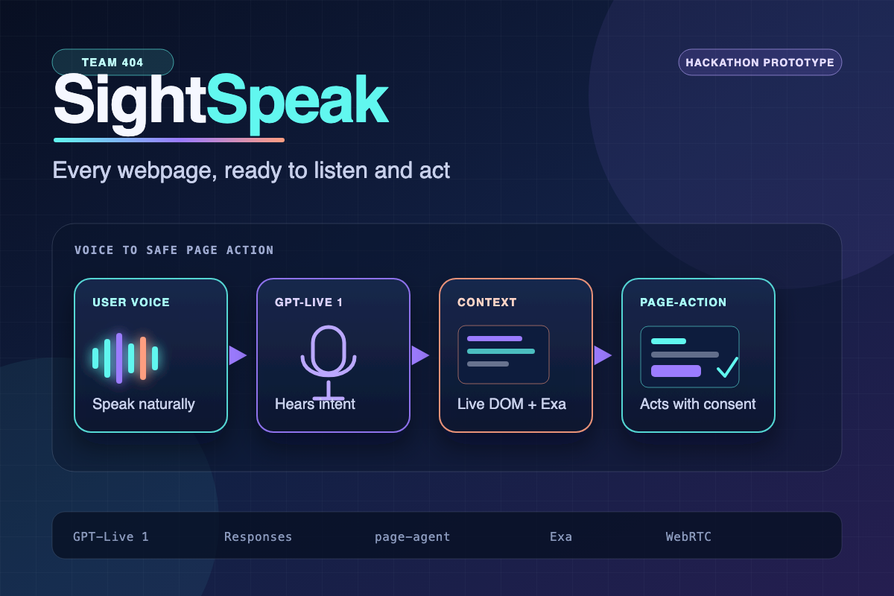
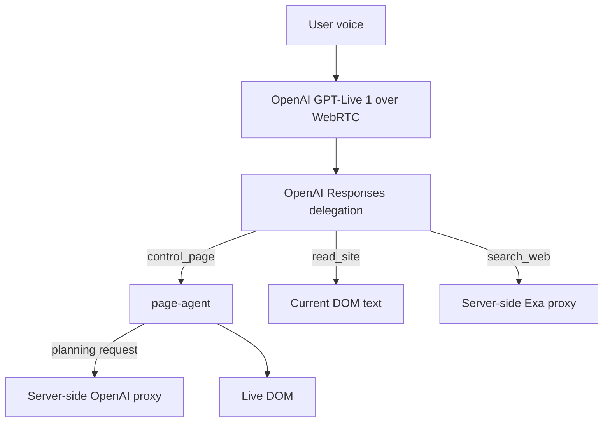

# SightSpeak

Every webpage, ready to listen and act.

<p align="center">
  
</p>

SightSpeak gives any webpage a voice interface and an agentic action layer. It can be added as an embedded widget or Chrome extension, so a person can speak to read the page, scroll, click, fill forms, navigate, or search the live web.

People naturally use conversation to ask for help, yet webpages often require a specific language, visual reading, and controls that take time to learn. SightSpeak lets a person express a goal in their own words and complete the task on the page without depending on someone else to navigate it.

Built for AI Tinkerers Abu Dhabi — Team 404.

## Links

- **Video demo:** https://youtu.be/xQ7STxtgU9M
- **Main website:** https://ai-tinkers-abudhabi-team-404.vercel.app/
- **Live demo:** https://ai-tinkers-abudhabi-team-404.vercel.app/demo
- **Pitch deck:** https://ai-tinkers-abudhabi-team-404.vercel.app/deck
- **Repository:** https://github.com/vagoel/ai-tinkers-abudhabi-team-404
- **Hackathon:** https://abu-dhabi.aitinkerers.org/p/agents-everywhere-bots-channels-more-global-hackathon
- **OpenAI:** https://platform.openai.com/
- **Exa:** https://dashboard.exa.ai/
- **OpenRouter sponsor:** https://openrouter.ai/
- **Exa agent skills:** https://github.com/exa-labs/agent-skills
- **Message from sponsors (YouTube):** https://youtu.be/XV4gXDUpmqw?si=VWg6GP-TWqm3Gq2h
- **Event photos:** https://drive.google.com/drive/folders/1EMqcGJf-qrbXs3IQCIIDb6MOhYnYwVEL

## Architecture

| Component | Role |
| --- | --- |
| **OpenAI GPT-Live 1** | Low-latency speech in/out and delegation to the intelligence model |
| **OpenAI Responses** | Intelligence and selection of browser tools |
| **OpenAI Chat Completions** | Intelligence for page-agent's DOM planning loop |
| **page-agent** | Reads the live DOM and performs clicks, typing, scrolling, and navigation |
| **Exa** | Searches the web and retrieves URL contents through server-side routes |

The React demo and standalone injectable widget share the same implementation in `src/lib/voice-agent`. Both API keys stay on the Next.js server.



## Setup

Requires Node.js 20.9 or newer.

1. Install dependencies:

   ```bash
   npm install
   ```

2. Create `.env` with the two server-side keys:

   ```dotenv
   OPEN_AI_KEY=...
   EXA_KEY=...
   ```

   The project intentionally uses the existing key names `OPEN_AI_KEY` and `EXA_KEY`. Optional model and proxy settings are documented in `.env.example`.
   Page-agent's animated cursor and navigation mask are enabled by default, while indexed-element bounding boxes and labels stay hidden. Set `NEXT_PUBLIC_PAGE_AGENT_OVERLAY=false` only to disable the cursor and mask for compatibility testing.

3. Start the app:

   ```bash
   npm run dev
   ```

4. Open `http://localhost:3000/demo`, press the microphone, and allow microphone access.

   To use it on another page, build and install the Chrome extension:

   ```bash
   npm run build:extension
   ```

   Then open `chrome://extensions`, enable Developer mode, select **Load unpacked**, and choose `dist/chrome-extension`. Click the extension toolbar icon to add or remove SightSpeak on the current page.

5. Rebuild the standalone widget after changing its code or public proxy origin:

   ```bash
   npm run build:widget
   ```

## Useful commands

```bash
npm run dev
npm run lint
npm run typecheck
npm run build:widget
npm run build:extension
npm run build
```

## Voice tools

- `read_site(query)` finds relevant content in the current page's live DOM.
- `control_page(instruction)` asks page-agent to perform one concrete DOM action.
- `search_web(query)` searches the live web through Exa and returns compact results for the voice model to summarize.

The voice prompt requires explicit confirmation before form submission, booking, purchasing, sending messages, or other consequential actions. GPT-Live uses the exact `gpt-live-1` model for speech, while Responses delegation and page-agent planning use `gpt-5.6-luna` with reasoning effort set to `none` for lower latency. The prompt and tool schemas live in `src/lib/server/openaiConfig.ts`.

## Demo prompts

- “What are your opening hours on Saturday?”
- “Scroll to the services section.”
- “Fill the booking form for Jane Doe.”
- “How much do other clinics in Abu Dhabi charge for physiotherapy?”

## Limitations

- Microphone access requires HTTPS or localhost.
- Multilingual voice interaction is a target use case and needs validation beyond the current `en-US` configuration.
- Some sites block injected scripts through Content Security Policy.
- Cross-page navigation unloads an injected widget unless the destination also includes it.
- The demo booking form is illustrative and does not submit to a backend.
